# Software Architecture Template

Use this template whenever you add or revise a subsystem. Fill it out as Markdown in the repository so we can diff changes and link artifacts. Diagrams can be embedded using [Mermaid](https://mermaid.js.org/) or PlantUML—Mermaid is preferred because GitHub renders it in the browser. Keep diagrams text-based so Codex can parse and mirror them into the filesystem layout.

---

## 1. Overview
- **Subsystem / Feature Name**: OnBoard Comuter (OBC) Stack
- **Revision**: v1.0
- **Purpose**: 
  1) Communicate telemetry information to FC
  2) Handle sensor & camera input + preprocessing (optical flow + state estimation -> FC)
  3) publish camera and sensor data to GCS

- **Subsystem / Feature Name**: BlueRobotics Flight Controller (FC) Firmware
- **Revision**: v1.0
- **Purpose**: 
  1) Actuate 8 ESCs
  2) Preliminary sensor fusion from IMU + compass
  3) Active control system for ROV w/ simple software current limits 

- **Subsystem / Feature Name**: Ground Control Station (GCS) Stack
- **Revision**: v1.0
- **Purpose**: 
  1) Intake user input from logitech controller via usb serial
  2) Visualize incoming data streams
  3) Log telemetry and camera data for replay.

## 2. Context & Requirements
- **Inputs**: 
  - Sensors
    - Internal Mesurement Unit (IMU)
    - Compass 
    - Depth Sensor
    - ESC EMI feedback
  - User Input
    - USB Controller
    - Emergency Stop (E-Stop)
  - Services
    - Control System
    - Data Storage
- **Outputs**: 
  - Actuator Commands (8x Thrusters)
  - Visualization

## 3. Architecture Diagram

```mermaid
---
config:
  layout: elk
  elk:
    nodePlacementStrategy: LINEAR_SEGMENTS
    forceNodeModelOrder: false
---
flowchart LR
 subgraph GCS["Ground Control Station"]
        Joy["USB Joystick Node"]
        CmdVel[/"gcs/cmd_vel"/]
        EstopBtn["Physical E-Stop Monitor"]
        Estop[/"gcs/estop"/]
        UnifiedUI["Unified Video + Telemetry Dashboard"]
  end
 subgraph OBC["Onboard Computer"]
        CameraPipeline[/"Camera Pipeline"/]
        OpticalFlow["OpticalFlow"]
        Estimator["State Estimator"]
        StateEst[/"obc/state/est"/]
        OBCMux[/"Command Mapper"/]
        TelemetryBridge[/"obc/health"/]
        VideoBridge[/"obc/camera/front|bottom"/]
        MavlinkBridge[/"MAVROS Serial Bridge"/]
  end
 subgraph VehicleSensors["Sensors & Cameras"]
        IMU["IMU + Compass"]
        Depth["Depth Sensor"]
        FrontCam["Front Camera"]
        BottomCam["Bottom Camera"]
  end
 subgraph FC["Flight Controller (ArduSub)"]
        SensorDrivers[/"Sensor Drivers"/]
        NavSensors["Navigator Sensors"]
        LeakWatch["Leak & Pressure Watchdog"]
        CoreLoops["Attitude/Rate PID + Mixer"]
        Thrusters["Thrusters"]
        EMI["ESC EMI Feedback"]
        MAVPub["MAVROS Topic Streams"]
  end
    Joy --> CmdVel
    EstopBtn --> Estop
    CmdVel -- "ROS 2 DDS" --> OBCMux
    Estop -- "ROS 2 DDS" --> OBCMux
    VideoBridge -- "Image Streams" --> UnifiedUI
    TelemetryBridge -- "Diagnostics" --> UnifiedUI
    StateEst -- "/obc/state/est" --> UnifiedUI
    SensorDrivers --> Estimator
    SensorDrivers --> TelemetryBridge
    CameraPipeline --> OpticalFlow
    CameraPipeline --> VideoBridge
    OpticalFlow --> StateEst
    Estimator --> StateEst
    Estimator -- "/fc/imu/filtered" --> MavlinkBridge
    OBCMux -- "/fc/thruster_setpoint" --> MavlinkBridge
    MavlinkBridge -- "Actuator Cmds" --> CoreLoops
    NavSensors --> CoreLoops
    LeakWatch --> CoreLoops
    CoreLoops --> Thrusters
    Thrusters --> EMI --> CoreLoops
    CoreLoops --> MAVPub
    MAVPub -- "/mavros/state|sys_status|battery" --> TelemetryBridge
    MAVPub -- "/mavros/imu/*" --> Estimator
    IMU --> SensorDrivers
    Depth --> SensorDrivers
    FrontCam --> CameraPipeline
    BottomCam --> CameraPipeline
```

[![](https://mermaid.ink/img/pako:eNqFVu1O6zgQfRXLP1Z3d1sKpUCbHyvRDxBXFCoCrLRkhdxkmlgkceQ4LF3g3e_YTtK6KgIJGI_PjGfOfCjvNBQRUI92u90gD0W-4rEX5ISkbC0q5RFIX_QR_xk1ITniFykLIYNc-UoyBfHaI9dXN7Pzu2d_djmf3dz7FrsSMoQbNJjjb3orI5AeWbG0hCA3D65S8V-YMKnI9R2alNUylqxIyOXEfwropRRVHpGJyJUUKfEVU1zkAf3Xetc_P8UagQ_-WEul4uEL0e85mEkWPUL61AtoHJa9MIueXyENaG8LMiuVKMYqR1-LZF3ykKVk1vVRSeYi50pIx6OBNw5BH1x3DzlfcYgernRsViaPPAJB_iT3kCJ1Sq7JlJXJUjAZ1b4hj7Y5uB1P0Pw2NxAkISsqBW4cE5aBZAteQMpz0AFZDWlUbli3hdKZXSDp2vPmtJsczximjBhNOWw0Ds7c4ZV-VizDXqnPmo2dR8eTefVmYhNZxrCec1YUOpFtVMvKWPIohsZnAixViQs1RLqw0GTdW0nslI-lUEpkrs2cvSIdLxur-fnj3a1PfJAcS231jclOHR4h4WEKPuSlkKUmxUrkt5r_0qHlav6AGPyLtdZFY6V7P4VCJYgw_4n15QAudBboGTFGrF9xMGOTowVZ2UXtpHChO-ki5XGimmlKQZIf5zKq_Gr5u1tXE9JU8lfAdHtNvqTWuMTesNcNMXjgse6T2oeb-DWwl7-ZCnXyWkb-FhLKspJAjD4SsdvdQsK1EIV2fa4UV1UEvTvdkIurKbI7528783CfyKpUYIJpZbe553omZ_5ES-QCIFqy8MWBYGssquVT2yP3ouAhdrsElpUOv3b_kG73r3rHWF2zTMyFOVi9xaCWBFQ77pPp1A-ogdkp2bL_HrY1BxZ8lTEU20CNQbuJrM3OmFm7KWdxLvTy_MKqmXQL7-0M-16L7R5qeKh3yBeAndBqypwFZynYWltfYbaosZgtIwNoMmoJt7F9c6eTX4U9nlW9FU-xtyCq03f2S_2kKdXGStX9-FyCKgTP1demjsp6OA9VZaLAJmqq1M6HtdqM4r7bdvr2XbZHW4l2cnJnqGwdcWy-9WBHqE7GyDUPGXuVorTd81Guy2ctVeXHkil8YV0ntrcV9vnRlfijNtppML2ATTW3G81e2c37xWWzfW2STmtZQLt69yJoh8YYNPWUrKBD8TJj-kjftXVAVYKZBdRDMWISF0-Qf6JNwfJ_hMgaM_zuiRPqmS-lDq2KCOnSUyrZBoIrCOQEP5AU9QaDY-ODeu_0jXrds9HoYHhyNOoPz44OR8dnJx26pl5_ODg4Oh0Mh6eDs8Hp4Wjw2aH_m1ePDk5GJ8PDk_7xoH886o-Gww6FSH_2zO3XoflI_PwFUT47QA?type=png)](https://mermaid.live/edit#pako:eNqFVu1O6zgQfRXLP1Z3d1sKpUCbHyvRDxBXFCoCrLRkhdxkmlgkceQ4LF3g3e_YTtK6KgIJGI_PjGfOfCjvNBQRUI92u90gD0W-4rEX5ISkbC0q5RFIX_QR_xk1ITniFykLIYNc-UoyBfHaI9dXN7Pzu2d_djmf3dz7FrsSMoQbNJjjb3orI5AeWbG0hCA3D65S8V-YMKnI9R2alNUylqxIyOXEfwropRRVHpGJyJUUKfEVU1zkAf3Xetc_P8UagQ_-WEul4uEL0e85mEkWPUL61AtoHJa9MIueXyENaG8LMiuVKMYqR1-LZF3ykKVk1vVRSeYi50pIx6OBNw5BH1x3DzlfcYgernRsViaPPAJB_iT3kCJ1Sq7JlJXJUjAZ1b4hj7Y5uB1P0Pw2NxAkISsqBW4cE5aBZAteQMpz0AFZDWlUbli3hdKZXSDp2vPmtJsczximjBhNOWw0Ds7c4ZV-VizDXqnPmo2dR8eTefVmYhNZxrCec1YUOpFtVMvKWPIohsZnAixViQs1RLqw0GTdW0nslI-lUEpkrs2cvSIdLxur-fnj3a1PfJAcS231jclOHR4h4WEKPuSlkKUmxUrkt5r_0qHlav6AGPyLtdZFY6V7P4VCJYgw_4n15QAudBboGTFGrF9xMGOTowVZ2UXtpHChO-ki5XGimmlKQZIf5zKq_Gr5u1tXE9JU8lfAdHtNvqTWuMTesNcNMXjgse6T2oeb-DWwl7-ZCnXyWkb-FhLKspJAjD4SsdvdQsK1EIV2fa4UV1UEvTvdkIurKbI7528783CfyKpUYIJpZbe553omZ_5ES-QCIFqy8MWBYGssquVT2yP3ouAhdrsElpUOv3b_kG73r3rHWF2zTMyFOVi9xaCWBFQ77pPp1A-ogdkp2bL_HrY1BxZ8lTEU20CNQbuJrM3OmFm7KWdxLvTy_MKqmXQL7-0M-16L7R5qeKh3yBeAndBqypwFZynYWltfYbaosZgtIwNoMmoJt7F9c6eTX4U9nlW9FU-xtyCq03f2S_2kKdXGStX9-FyCKgTP1demjsp6OA9VZaLAJmqq1M6HtdqM4r7bdvr2XbZHW4l2cnJnqGwdcWy-9WBHqE7GyDUPGXuVorTd81Guy2ctVeXHkil8YV0ntrcV9vnRlfijNtppML2ATTW3G81e2c37xWWzfW2STmtZQLt69yJoh8YYNPWUrKBD8TJj-kjftXVAVYKZBdRDMWISF0-Qf6JNwfJ_hMgaM_zuiRPqmS-lDq2KCOnSUyrZBoIrCOQEP5AU9QaDY-ODeu_0jXrds9HoYHhyNOoPz44OR8dnJx26pl5_ODg4Oh0Mh6eDs8Hp4Wjw2aH_m1ePDk5GJ8PDk_7xoH886o-Gww6FSH_2zO3XoflI_PwFUT47QA)

### Flight Controller Internals (ArduSub + MAVROS)
- **Core loops**: ArduSub runs attitude/rate PID controllers, thruster mixing (Vectored ROV frame), leak and pressure watchdogs, and hardware failsafes (E-Stop, disarm, low-voltage). Navigator-integrated IMU/magnetometer data are fused at 1 kHz before exposing filtered states on the MAVLink bus.
- **Local sensors**: Navigator IMU, compass, barometer, leak probes, and ESC electrical feedback stay on the FC; only filtered IMU (`/fc/imu/filtered`) and actuator commands flow between FC and OBC.
- **MAVROS interface topics** (published/consumed on the OBC via `software/onboard/mavlink/`):
  - `/mavros/state`, `/mavros/sys_status`, `/mavros/battery`: connection, arming, voltage/current telemetry.
  - `/mavros/imu/data`, `/mavros/imu/data_raw`, `/mavros/imu/mag`: IMU streams for estimator backfeed.
  - `/mavros/rc/out`, `/mavros/actuator_control`, `/mavros/servo_output/raw`: thruster command diagnostics and confirmation of FC-side mixing.
  - `/mavros/setpoint_raw/attitude`, `/mavros/setpoint_raw/target_attitude`, `/mavros/setpoint_raw/thrust`: optional high-level control hooks if OBC needs to delegate loops to ArduSub.
  - `/mavros/companion_process/status`, `/mavros/extended_state`: health/failsafe states mirrored to the telemetry dashboard.
- **Failsafe behavior**: Loss of companion link, EMI anomalies, leak detection, or latched `/gcs/estop` all trigger ArduSub's hardware-level disarm paths; the FC continues logging to onboard flash even if the OBC is offline.

## 4. Component Breakdown
| Component | Tech / Language | Responsibilities | Repo Path |
|-----------|-----------------|------------------|-----------|
| `joy_bridge` | ROS 2 Python (`sensor_msgs/Joy`) | Map joystick axes/buttons to `/gcs/cmd_vel` and discrete mode topics | `software/ground_station/input_bridge/` |
| `estop_monitor` | ROS 2 C++ | Monitor GPIO E-Stop, publish `/gcs/estop` | `software/ground_station/estop/` |
| `unified_dashboard` | Qt + ROS 2 (rclpy + GStreamer/rviz) | Combine video streams + telemetry view of `/obc/health`, `/obc/state/est`, `/mavros/*`, `/gcs/cmd_vel` | `software/ground_station/telemetry_ui/` |
| `sensor_drivers` | ROS 2 C++ | Publish `sensor_msgs/Imu`, compass, depth from BlueRobotics sensors | `software/onboard/sensors/` |
| `camera_pipeline` | ROS 2 + OpenCV | Publish `sensor_msgs/Image`, optional optical flow results | `software/onboard/cameras/` |
| `state_estimator` | ROS 2 C++ | Fuse IMU + optical flow + depth to `nav_msgs/Odometry` | `software/onboard/estimation/` |
| `command_mapper` | ROS 2 C++ | Convert `/gcs/cmd_vel` + state to `mavros_msgs/ActuatorControl` | `software/onboard/control/` |
| `telemetry_bridge` | ROS 2 Python | Collect diagnostics (`/obc/health`, `/mavros/state`, `/mavros/battery`) and serve to dashboard + logger | `software/onboard/telemetry/` |
| `mavlink_interface` | MAVROS | Maintain Navigator serial link, expose `/mavros/*` topics, forward `/fc/imu/filtered` + actuator commands | `software/onboard/mavlink/` |

## 5. Data & Interface Contracts
- GCS ↔ OBC Control:
  - `/gcs/cmd_vel` (`geometry_msgs/Twist`): Joystick bridge → command mapper; reliable QoS, 50 Hz.
  - `/gcs/estop` (`std_msgs/Bool`): Latched true when the hardware button trips; consumed by command mapper + FC failsafe logic.
- Sensor & Estimation:
  - `/obc/imu/raw` (`sensor_msgs/Imu`), `/obc/mag` (`geometry_msgs/Vector3Stamped`), `/obc/depth` (`sensor_msgs/FluidPressure`): Sensor drivers → estimator + telemetry bridge.
  - `/obc/camera/front`, `/obc/camera/bottom` (`sensor_msgs/Image` + optional compressed/flow topics): Camera pipeline → video bridge + optical flow.
  - `/obc/state/est` (`nav_msgs/Odometry`): Estimator → command mapper + unified dashboard.
  - `/fc/imu/filtered` (`sensor_msgs/Imu`): Estimator → FC via MAVROS for reuse in ArduSub loops.
- Telemetry & Visualization:
  - `/obc/health` (`diagnostic_msgs/DiagnosticArray`): Telemetry bridge summary of onboard nodes, voltages, temps for the unified dashboard and logging.
  - `/mavros/state`, `/mavros/sys_status`, `/mavros/battery` (`mavros_msgs/*`): MAVROS → telemetry bridge/dashboard to reflect FC status and energy.
  - `/mavros/imu/data`, `/mavros/imu/data_raw`, `/mavros/imu/mag` (`sensor_msgs/Imu` etc.): MAVROS → estimator for backfeed/validation displays.
  - `/mavros/rc/out`, `/mavros/actuator_control`, `/mavros/servo_output/raw` (`mavros_msgs/RCOut`, etc.): MAVROS → dashboard + bagging for thruster debug overlays.
- Actuation:
  - `/fc/thruster_setpoint` (`mavros_msgs/ActuatorControl`): Command mapper → MAVROS → ArduSub mixers; best-effort QoS, 100 Hz.
  - `/mission/execute` (`mission_msgs/ExecuteMission` action): Optional auto routines triggered from the dashboard; goals routed to the OBC mission executive.

## 6. Deployment Mapping
- **GCS (Pi 5)**: Runs `joy_bridge`, `estop_monitor`, and the unified dashboard (`telemetry_ui` package + video widgets) inside `docker/gcs`. Needs USB joystick, HDMI, X11 forwarding, `/dev/input`, and hardware decoding for dual video streams.
- **OBC (Pi 5)**: Runs sensors, cameras, estimator, command mapper, telemetry bridge, MAVROS inside `docker/obc`. Requires CSI/USB cameras, I²C, UART to FC, `/dev/video*`, `/dev/ttyAMA0` exposure.
- **FC (Pixhawk/BlueRobotics)**: Executes ArduSub firmware; communicates via MAVLink serial to OBC; directly drives 8 ESC outputs and reads hardware failsafes.

## 7. Blue Robotics Navigator Interfaces
- **Firmware compatibility**: ArduSub ≥ 4.1.0 (ROV), Rover ≥ 4.2.3, Copter ≥ 4.2.3, Plane ≥ 4.2.3.
- **Integrated sensors**: ICM-20602 IMU, MMC5983 + AK09915 magnetometers, BMP280 barometer, ADS1115 ADC.
- **Connectivity**: 3× UART, 2× I²C, combined UART/I²C port, dual ADC inputs (3.3 V & 6.6 V), RC receiver, 16× PWM out, SOS leak probes, auxiliary SOS, fan PWM, RGB/user LEDs, power-module connector.
- **Software stacks**: Navigator firmware exposes MAVLink channels consumed via `mavros`; Blue Robotics publishes Navigator Python/C++ and Rust SDKs to access GPIO/ADC/LEDs when running Companion software. Use these libraries within `software/onboard/mavlink/` for board-specific utilities (fan control, leak detection, LED signaling).
